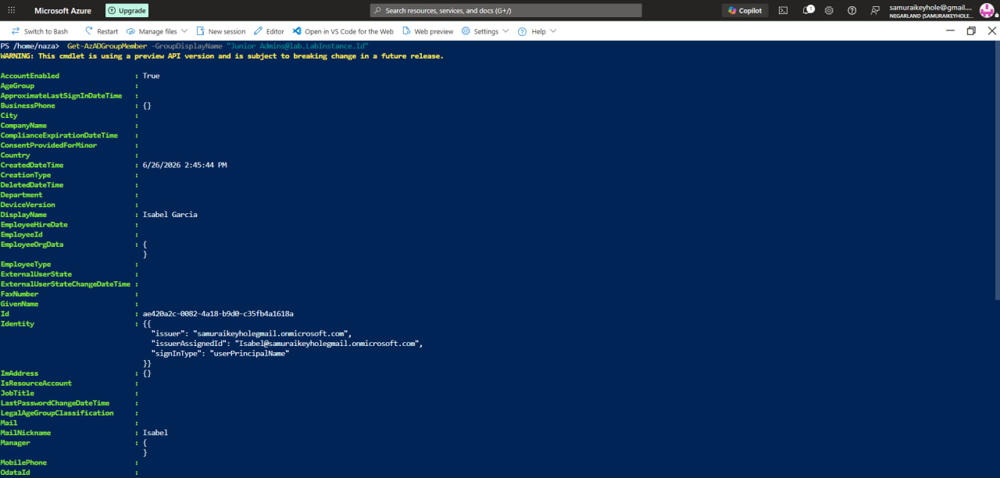
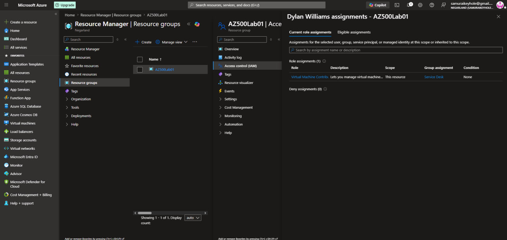

[← Back to portfolio home](../README.md)

# Lab 01 — Role Based Access Control

**Objective:** Create Microsoft Entra ID groups for different admin tiers, add members via multiple tools (Portal, PowerShell, Azure CLI), and assign RBAC roles scoped to a resource group.

**What I did:**
- Created three Entra ID groups representing different access tiers: **Senior Admins**, **Junior Admins**, and **Service Desk**
- Added members using different tools per group, as required by the lab (Portal, PowerShell `Get-AzADGroupMember`, and Azure CLI `az ad group member add`) — verified membership for **Isabel Garcia** (Junior Admins) and **Dylan Williams** (Service Desk)
- Assigned the **Virtual Machine Contributor** role to the **Service Desk** group, scoped to the `AZ500Lab01` resource group
- Verified the role assignment by checking Dylan Williams's effective **current role assignments** on the resource group — confirmed "Virtual Machine Contributor" inherited via the Service Desk group

**Skills demonstrated:** Microsoft Entra ID group management, RBAC role assignment and scoping, PowerShell (`Get-AzADGroupMember`) and Azure CLI (`az ad group`) identity administration, access verification.

  
  

