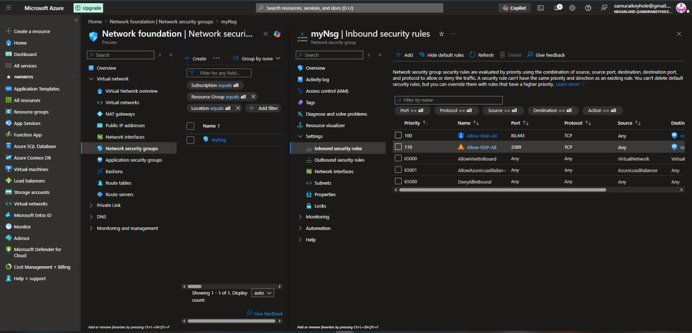
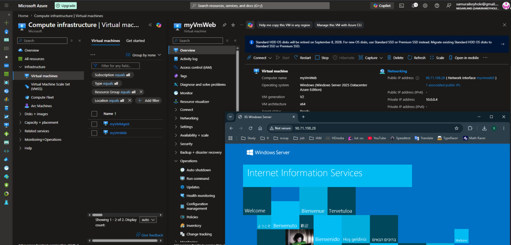

[← Back to portfolio home](../README.md)

# Lab 02 — Network Security Groups & Application Security Groups

**Objective:** Configure a Network Security Group to control inbound web and RDP traffic to a VM, then verify the web server is reachable as expected.

**What I did:**
- Created a Network Security Group (`myNsg`) with inbound rules:
  - `Allow-Web-All` — ports 80/443, TCP, priority 100
  - `Allow-RDP-All` — port 3389, TCP, priority 110
- Associated the NSG with a subnet containing the target VM
- Deployed a Windows Server VM (`myVmWeb`) with IIS installed
- Verified the NSG rules worked as intended by browsing to the VM's public IP and confirming the default **IIS "Welcome"** page loaded successfully over HTTP

**Skills demonstrated:** Network Security Group rule design (priority ordering, service ports), IIS web server deployment on Azure VMs, inbound traffic verification.

  
  

