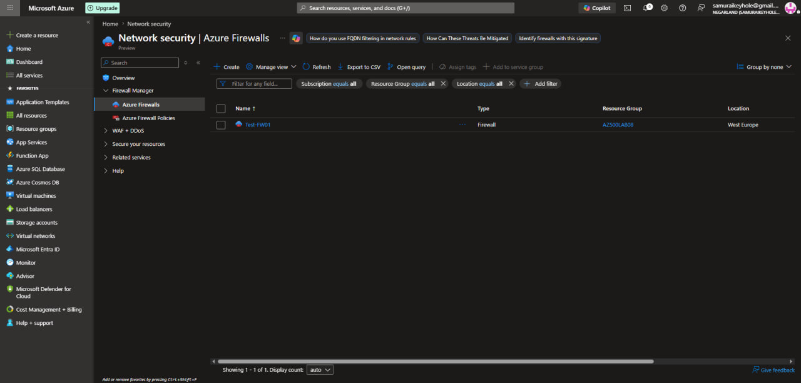
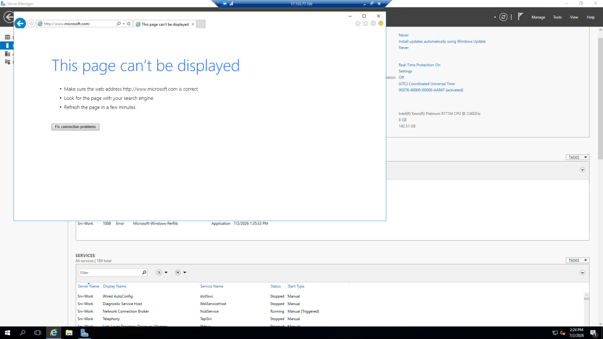

[← Back to portfolio home](../README.md)

# Lab 03 — Azure Firewall

**Objective:** Deploy Azure Firewall to centrally control and restrict outbound network traffic from protected VMs.

**What I did:**
- Deployed an Azure Firewall instance (`Test-FW01`) in the `AZ500LAB08` resource group (West Europe)
- Routed a protected VM's traffic through the firewall and configured network/application rules to restrict outbound access
- Verified enforcement by attempting to browse to an unauthorized destination (`microsoft.com`) from the protected server — the connection was correctly blocked, confirming the firewall's rule set was actively filtering traffic rather than defaulting to allow-all

**Skills demonstrated:** Azure Firewall deployment and rule configuration, outbound traffic filtering, network routing through a centralized firewall appliance, positive/negative access testing.

  
  

