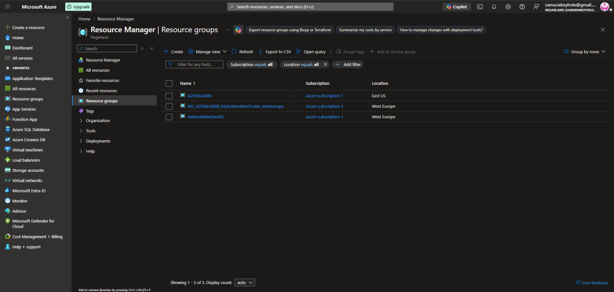
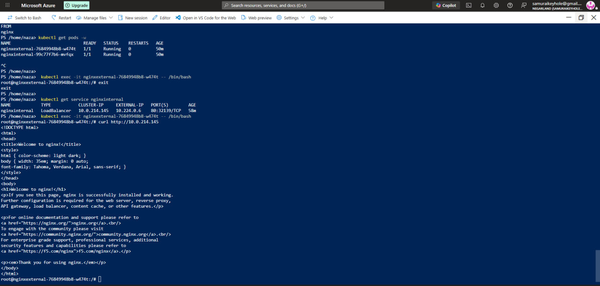

[← Back to portfolio home](../README.md)

# Lab 04 — Configuring and Securing ACR and AKS

**Objective:** Push a container image to Azure Container Registry (ACR) and run it as a pod on Azure Kubernetes Service (AKS), validating registry access, image pull configuration, and internal service networking.

**What I did:**
- Deployed an AKS cluster (`MyKubernetesCluster`, West Europe) connected to an Azure Container Registry, under resource group `AZ500LAB09`
- Diagnosed a pod stuck in `ImagePullBackOff` via `kubectl describe pod`, tracing the failure to an empty ACR repository — the image had never actually been pushed
- Root cause: work was being done inside **Azure Cloud Shell**, which has no Docker daemon, so `docker build`/`push` could not run there
- Used **`az acr import`** to pull the public `nginx` image directly into ACR server-side, bypassing the need for a local Docker daemon entirely
- Verified full success: both `nginxexternal` and `nginxinternal` pods reported `Running` status; confirmed the internal LoadBalancer service (`nginxinternal`, ClusterIP `10.0.214.145`) was reachable by `curl`-ing it from inside the external pod and receiving the default nginx welcome HTML response

**Challenges & fixes:**

| Issue | Root Cause | Fix |
|---|---|---|
| Pod stuck in `ImagePullBackOff` | Image referenced in the deployment manifest never existed in ACR | Traced via `kubectl describe pod` → confirmed empty registry with `az acr repository list` |
| `docker build`/`push` failed: *"Cannot connect to the Docker daemon"* | Azure Cloud Shell has no Docker daemon by design | Used `az acr import --source docker.io/library/nginx:latest` to import the image server-side, no Docker required |

**Skills demonstrated:** AKS, ACR, Kubernetes troubleshooting (`kubectl describe`, `kubectl get pods -w`, `kubectl exec`), internal service networking (ClusterIP LoadBalancer), container registry image management, understanding Cloud Shell environment limitations.

  
  

