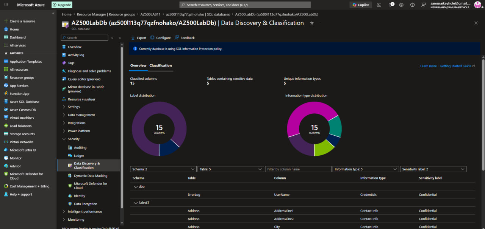
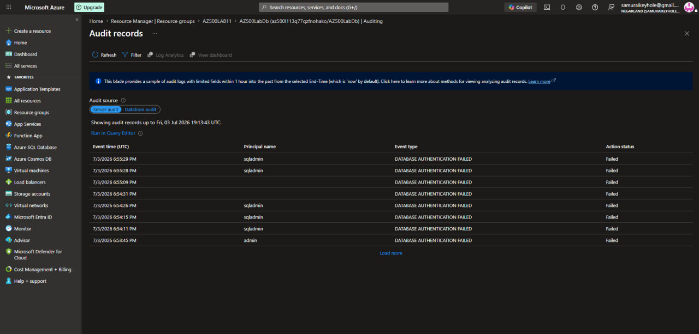

[← Back to portfolio home](../README.md)

# Lab 05 — Securing Azure SQL Database

**Objective:** Deploy an Azure SQL Database, apply data classification labels to sensitive columns, and configure and verify SQL auditing.

**What I did:**
- Deployed Azure SQL Server + Database (`AZ500LabDb`) via a custom ARM template, resolving `RegionDoesNotAllowProvisioning` errors by scripting a region-availability check across 9 candidate regions and landing on Central US
- Ran **Data Discovery & Classification**, reviewing and confirming **15 classified columns** across 5 tables (e.g., `UserName` → Credentials/Confidential, `Address` fields → Contact Info/Confidential)
- Configured **SQL Auditing** and confirmed it was actively logging by reviewing **Audit records**, which captured multiple real `DATABASE AUTHENTICATION FAILED` events tied to specific principal names (`sqladmin`, `admin`) with exact timestamps

**Skills demonstrated:** ARM template authoring, Azure SQL Database, Data Discovery & Classification, SQL Auditing and audit log review/verification, PowerShell scripting for infrastructure troubleshooting.

  
  

