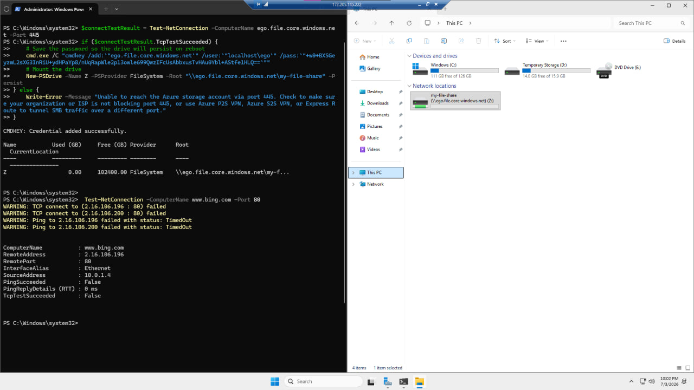
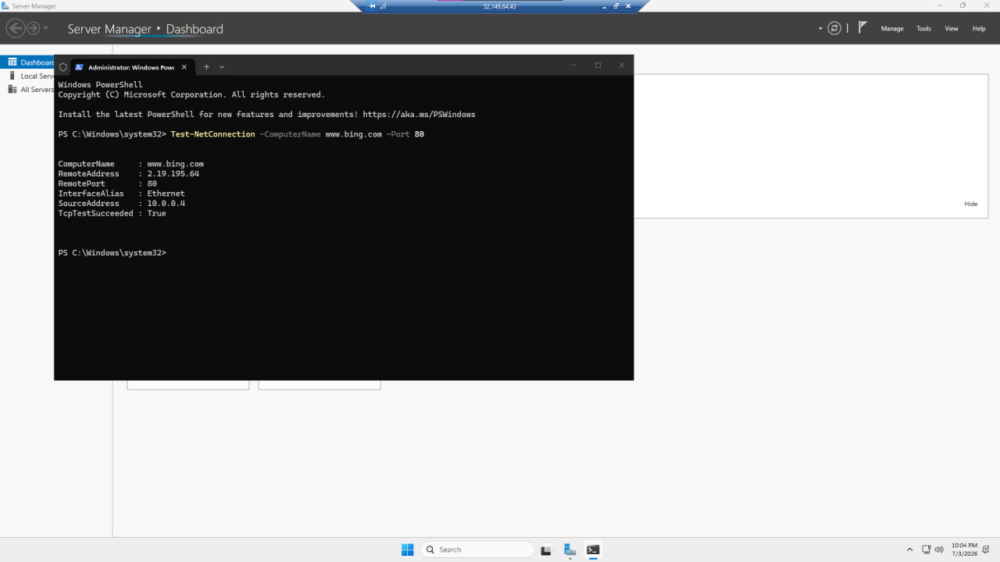

[← Back to portfolio home](../README.md)

# Lab 06 — Service Endpoints and Securing Storage

**Objective:** Build a segmented network (public/private subnets) with NSGs, and use a **Storage Account service endpoint** to prove that only VMs on the private, whitelisted subnet can reach storage — while a VM on the public subnet can reach the internet but not storage.

**What I did:**
- Built a Virtual Network with separate public and private subnets, each with its own NSG
- Configured the Storage Account's networking to **"Selected networks,"** whitelisting only the private subnet via a service endpoint
- Verified the segmentation from both sides:
  - **From the private VM:** successfully mounted the storage file share as a `Z:` drive (`New-PSDrive`) after a successful `Test-NetConnection` to the storage endpoint on port 445 — then confirmed general internet access correctly **failed** (`Test-NetConnection www.bing.com -Port 80` → `TcpTestSucceeded: False`, ping timed out)
  - **From the public VM:** confirmed general internet access **worked** (`Test-NetConnection www.bing.com -Port 80` → `TcpTestSucceeded: True`), demonstrating the inverse of the private VM's restricted profile

**Skills demonstrated:** Virtual Network segmentation, Network Security Groups, Storage Account service endpoints, `New-PSDrive` SMB share mounting over port 445, `Test-NetConnection` for access verification, positive/negative network testing methodology.

  
  

