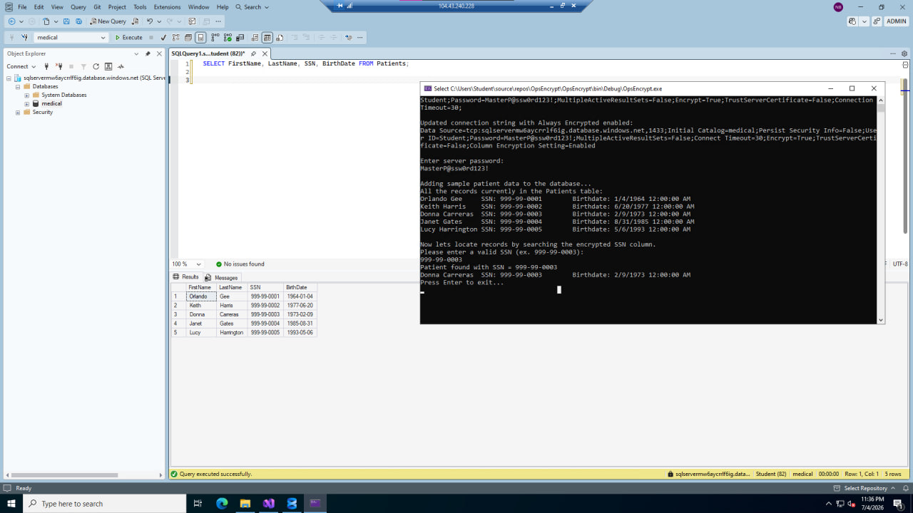
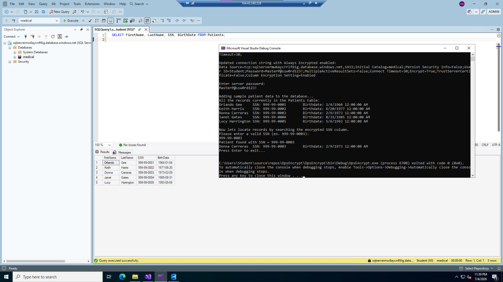

[← Back to portfolio home](../README.md)

# Lab 07 — Key Vault: Implementing Always Encrypted

**Objective:** Configure SQL Server **Always Encrypted** using Azure Key Vault to protect sensitive database columns, using a custom .NET console application to manage the column master key and column encryption key.

**What I did:**
- Configured a Key Vault–backed encryption workflow for Azure SQL using the `AzureKeyVaultProvider` to store and manage the Column Master Key (CMK)
- Built a Visual Studio (.NET Framework 4.7.2) console application (`OpsEncrypt`) that connects with `Column Encryption Setting=Enabled`, populates a `Patients` table with sample data, and demonstrates transparent encryption/decryption
- Ran a live end-to-end demo: the app inserted 5 patient records with encrypted `SSN` values, then successfully **searched for and located a specific patient by their plaintext SSN input** (`999-99-0003` → correctly returned "Donna Carreras"), proving the encrypted column could still be queried transparently through the application layer while remaining encrypted at rest in SQL Server

**Challenges & fixes:**

| Issue | Root Cause | Fix |
|---|---|---|
| SSMS failed to retrieve auth token — `AADSTS50076` MFA error | Tenant's Security Defaults policy required MFA that the WAM broker couldn't complete non-interactively | Registered a proper MFA method via Microsoft Authenticator; temporarily disabled tenant Security Defaults for the lab environment |
| `Install-Package` failed with "Unable to find package" for the AlwaysEncrypted/ADAL provider packages | Visual Studio's Package Manager Console was pointed at the **offline local package cache** instead of nuget.org | Manually registered `https://api.nuget.org/v3/index.json` as a package source, then re-ran installs successfully |

**Skills demonstrated:** Azure Key Vault, SQL Server Always Encrypted (column master key + column encryption key), Microsoft Entra ID / Conditional Access & MFA troubleshooting, Visual Studio / NuGet dependency management, .NET Framework console app development, encrypted-column querying.

  
  

