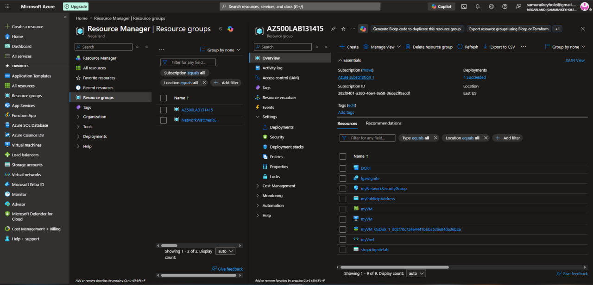
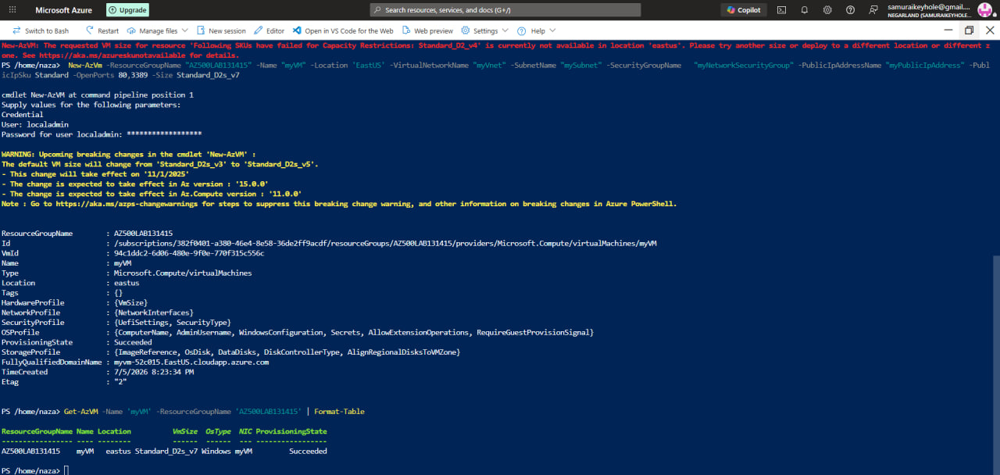

[← Back to portfolio home](../README.md)

# Lab 08 — Log Analytics Workspace, Storage Account, DCR

**Objective:** Deploy the supporting infrastructure for centralized monitoring — a Log Analytics workspace, storage account, Data Collection Rule (DCR), and a target VM — as the foundation used later for Sentinel and Defender for Cloud.

**What I did:**
- Built out the full resource group (`AZ500LAB131415`) containing: a **Data Collection Rule** (`DCR1`), the Log Analytics workspace (`lgawlgnite`), a storage account (`strgactignitelab`), networking components (`myNetworkSecurityGroup`, `myPublicIpAddress`, `myVnet`), and target VMs
- Provisioned a Windows VM (`myVM`) via PowerShell `New-AzVM`, working through an initial **capacity/SKU availability error** (`Standard_D2_v4` unavailable in East US) by switching to an available SKU (`Standard_D2s_v7`) and confirming successful deployment (`ProvisioningState: Succeeded`) via `Get-AzVM`
- This workspace and resource group became the shared foundation later reused for both the **Defender for Cloud** (Lab 09) and **Sentinel** (Lab 11) exercises

**Challenges & fixes:**

| Issue | Root Cause | Fix |
|---|---|---|
| `New-AzVM` failed: requested VM size `Standard_D2_v4` not available for capacity in East US | Regional SKU capacity restriction at deployment time | Redeployed with an available SKU (`Standard_D2s_v7`); verified success via `Get-AzVM -Name 'myVM' \| Format-Table` |
| Also diagnosed separately: `Microsoft.Insights` provider not registered, blocking a monitoring-related action | Resource provider had never been registered on the subscription | Registered via `az provider register --namespace Microsoft.Insights`; resolved a subsequent Portal-vs-CLI cache mismatch by waiting for propagation and re-verifying account context |

**Skills demonstrated:** Azure Monitor / Log Analytics Workspace, Data Collection Rules, PowerShell VM provisioning (`New-AzVM`, `Get-AzVM`), Azure resource provider management, SKU/capacity troubleshooting.

  
  

