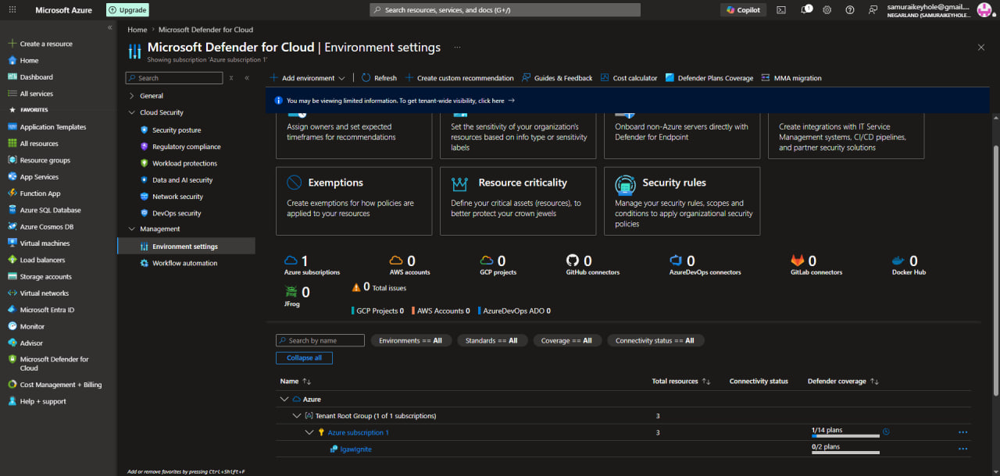
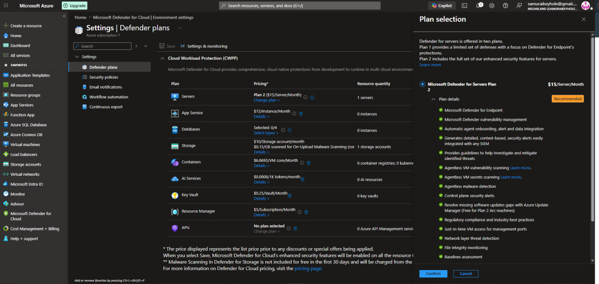

[← Back to portfolio home](../README.md)

# Lab 09 — Defender for Cloud Enhanced Security Features

**Objective:** Enable Microsoft Defender for Cloud's paid workload protection plans on the subscription, specifically Defender for Servers, to unlock enhanced security features including Just-in-Time VM access.

**What I did:**
- Reviewed **Environment settings** in Defender for Cloud, confirming subscription-level coverage (`Azure subscription 1`) and workspace-level coverage (`lgawlgnite`)
- Enabled **Microsoft Defender for Servers Plan 2** ($15/server/month), reviewing its full enhanced feature set before confirming: Defender for Endpoint integration, vulnerability management, agentless malware detection, file integrity monitoring, and — critically — **Just-in-time VM access for management ports**
- This enablement was the direct prerequisite that unlocked Lab 10's JIT VM access functionality

**Skills demonstrated:** Microsoft Defender for Cloud plan management, understanding tiered security feature sets (Plan 1 vs Plan 2), cost-aware security tooling decisions, workload protection configuration at subscription scope.

  
  

