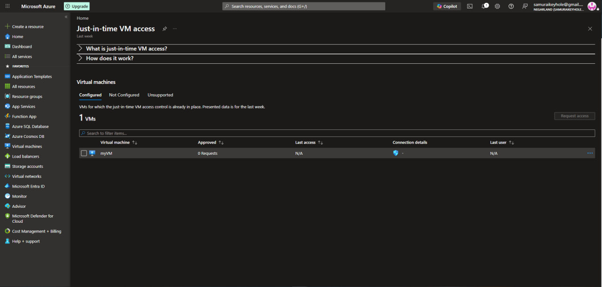
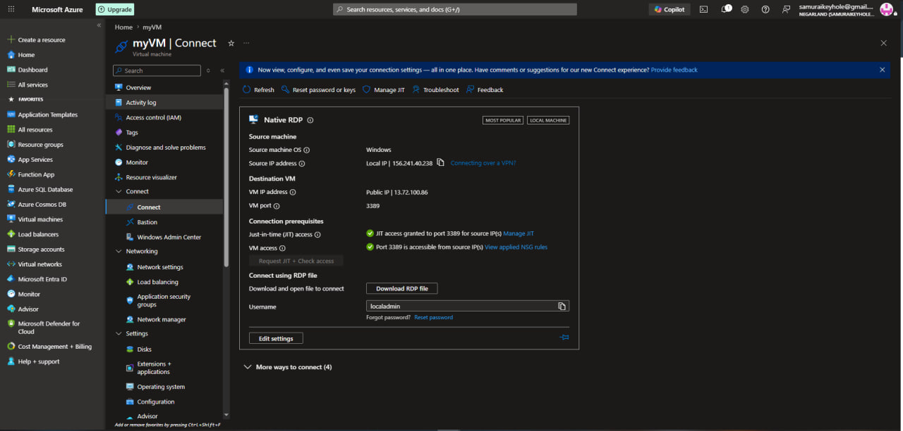

[← Back to portfolio home](../README.md)

# Lab 10 — Enable Just-in-Time Access on VMs

**Objective:** Configure Just-in-Time (JIT) VM access to eliminate always-open management ports, requiring explicit time-boxed approval before RDP/SSH access is granted.

**What I did:**
- Enabled JIT VM access for `myVM`, confirming it appeared under **Configured** VMs (1 of 1) in the Just-in-time VM access blade
- Requested and was granted JIT access to connect via RDP: the VM's **Connect** blade confirmed both prerequisites satisfied — ✅ *"JIT access granted to port 3389 for source IP(s)"* and ✅ *"Port 3389 is accessible from source IP(s)"* — before successfully establishing an RDP session
- This configuration is the same JIT policy later intentionally **removed** in Lab 11 to trigger the Sentinel detection/automation pipeline, tying these two labs together end-to-end

**Skills demonstrated:** Just-in-Time VM access configuration, time-boxed network access requests, RDP connection prerequisite verification, understanding JIT's role in reducing attack surface on management ports.

  
  

