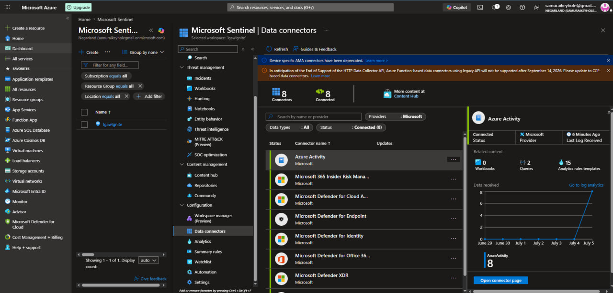
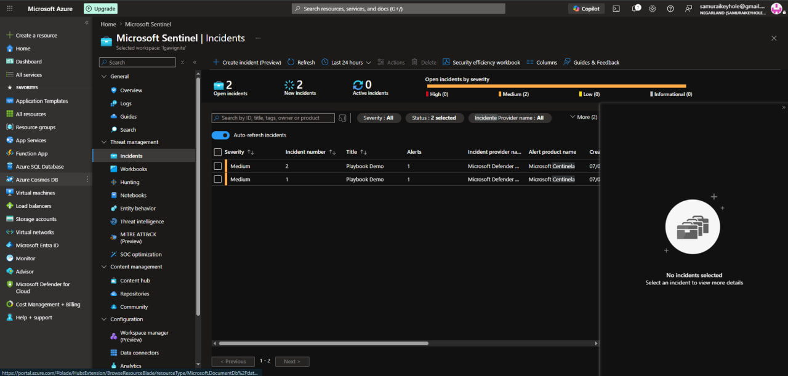

[← Back to portfolio home](../README.md)

# Lab 11 — Microsoft Sentinel: SIEM/SOAR Threat Detection & Automated Response

**Objective:** Stand up a Microsoft Sentinel workspace, ingest Azure Activity logs, build an analytics rule to detect the removal of a Just-in-Time (JIT) VM access policy (from Lab 10), and automatically trigger a Logic App playbook in response.

**What I did:**
- Onboarded Microsoft Sentinel to the `lgawlgnite` Log Analytics workspace (reusing the Lab 08 infrastructure)
- Installed and configured the **Azure Activity** data connector, correctly troubleshooting an initial resource-group-scoped Policy misconfiguration that prevented data ingestion — fixed via a subscription-scoped diagnostic setting. Final state confirmed: **8 of 8 connectors Connected**, with Azure Activity showing data received as recently as **6 minutes prior**
- Authored a KQL-based scheduled analytics rule to detect JIT policy deletions:
  ```kql
  AzureActivity
  | where ResourceProviderValue =~ "Microsoft.Security"
  | where OperationNameValue =~ "Microsoft.Security/locations/jitNetworkAccessPolicies/delete"
  ```
- Deployed a custom Logic App playbook (`Change-Incident-Severity`) via ARM template and linked it to the analytics rule through an automation rule
- Verified the full pipeline end-to-end by removing the JIT VM access policy configured in Lab 10: Sentinel's **Incidents** blade confirmed **2 "Playbook Demo" incidents** generated at Medium severity, proving detection worked correctly against real activity data

**Challenges & fixes:**

| Issue | Root Cause | Fix |
|---|---|---|
| Azure Activity connector showed "Not connected" / no data received | Azure Policy assignment wizard was scoped to a resource group instead of the subscription (Activity Log is a subscription-level resource) | Manually added a diagnostic setting directly on the subscription, routing Activity Logs to the Sentinel-linked Log Analytics workspace |
| Portal navigation didn't match documented lab steps (Analytics/Incidents blades) | Microsoft migrated key Sentinel management pages to the unified **Defender portal** (`security.microsoft.com`) after the lab was written | Located the equivalent functionality under Microsoft Sentinel's nested menu inside the Defender portal |

**Skills demonstrated:** Microsoft Sentinel (SIEM/SOAR), KQL query authoring, Azure Policy & diagnostic settings, Azure Monitor / Activity Log, Logic Apps (SOAR automation), Microsoft Defender for Cloud / JIT VM access integration, incident detection & automated response design, end-to-end security pipeline verification.

<p>
  
  
</p>
